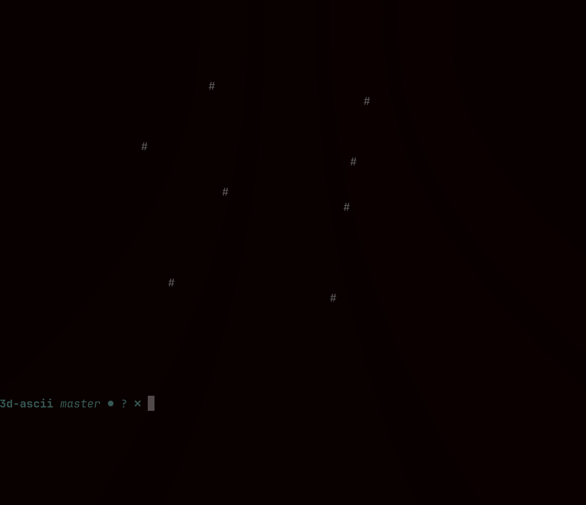

# 3d-ascii-cube

this is a simple 3d renderer of a 3d cube in the terminal

**building**:
```bash
  clang renderer.c -Wall -Wextra -Wpredantic -o renderer -lm
```
**running**:
```bash
  ./renderer
```

### example

*trust me it looks better when it is spinning*
